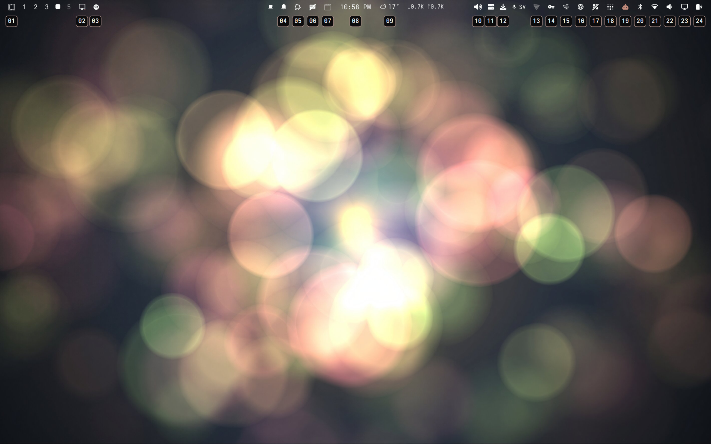
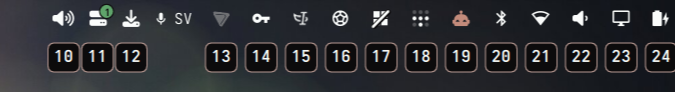

# Bar Hints

Keyboard hints for the Omarchy bar. Press `Super+B`, optionally type the start
of any word in a widget name to filter the hints, then type its number to open it.





## Install

```sh
omarchy plugin add https://github.com/hanssound/omarchy-bar-hints.git --enable
```

Add the binding to `~/.config/hypr/bindings.lua`. `Super+B` is unbound in stock
Omarchy 4, so it does not clash with a default (the stock browser binding is
`Super+Shift+B`):

```lua
o.bind("SUPER + B", "Bar icon hints",
  "omarchy-shell shell toggle io.github.hanssound.bar-hints '{}'")
```

## Use

| Input | Action |
|---|---|
| text | Filter by any word prefix, including CamelCase (case-insensitive) |
| number | Open the matching visible bar widget |
| Backspace | Remove the last typed digit, then the last filter character |
| Escape or background click | Dismiss |

Hover a hint to show the widget name. Hidden and non-interactive widgets are
not labeled. While filtering, a box shows the current query and remaining
match count.

## Requirements and limitations

- Omarchy 4 with the stock Omarchy bar.
- The plugin reads live stock-bar internals; custom replacement bars are not
  supported.
- Multi-monitor filtering follows the monitor focused when the overlay opens.
  This is implemented but has only been tested on a single display; behaviour
  with two or more monitors, or with mixed scale factors, is unverified.

Tested on Omarchy 4.0.1-1 with Hyprland on one 1920x1200 display, with the bar
on all four edges (top, bottom, left, right).

## Remove

Delete the `Super+B` binding, then run:

```sh
omarchy plugin remove io.github.hanssound.bar-hints
```
